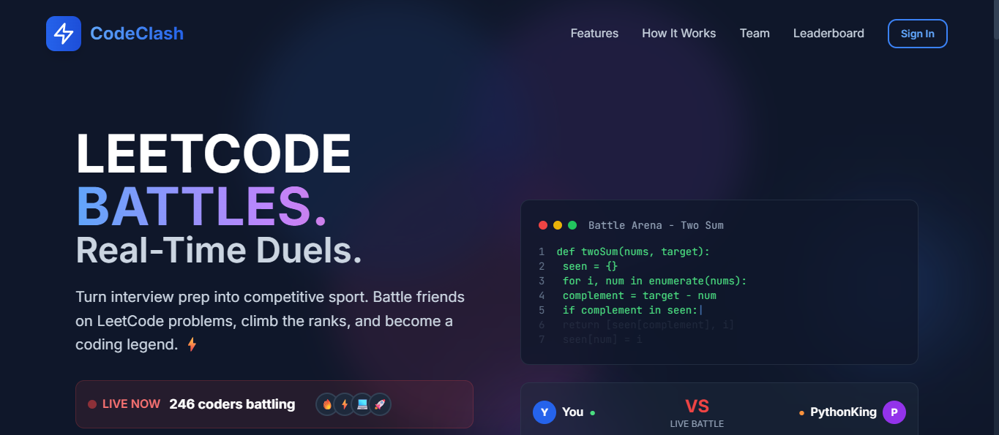

<p align="center">
  
</p>

<h1 align="center">CodeClash</h1>

<p align="center">
  <strong>LeetCode Battles. Real-Time Duels.</strong>
</p>

<p align="center">
  Turn interview prep into competitive sport. Battle friends on LeetCode problems, climb the ranks, and become a coding legend.
</p>

<p align="center">
  <a href="https://github.com/your-username/CodeClash/stargazers"></a>
  <a href="https://github.com/your-username/CodeClash/network/members"></a>
  <a href="https://github.com/your-username/CodeClash/issues"></a>
  <a href="https://github.com/your-username/CodeClash/blob/main/LICENSE"></a>
</p>

---

## Overview

CodeClash is a real-time competitive coding platform that transforms LeetCode-style interview preparation into an engaging multiplayer experience. Challenge friends, track progress, and rise through the ranks from Bronze to Grandmaster.

## Features

- **Real-time 1v1 Battles** - Race against opponents to solve coding problems with live updates
- **Multiple Authentication Methods** - Support for email/password and Google OAuth integration
- **User Profiles** - Customizable avatars, skill tracking, and personalized coding goals
- **Comprehensive Ranking System** - Progress through competitive tiers from Bronze to Grandmaster
- **Global Leaderboards** - Track your performance against the community
- **Modern Responsive UI** - Clean interface built with Tailwind CSS, optimized for all devices

## Tech Stack

### Frontend
- **React 18** - Modern React with hooks and functional components
- **Tailwind CSS** - Utility-first CSS framework for rapid UI development
- **Socket.io Client** - Real-time bidirectional event-based communication
- **Lucide React** - Beautiful and consistent icon library

### Backend
- **Node.js & Express** - Fast, unopinionated web framework
- **Socket.io** - WebSocket library for real-time features
- **JWT Authentication** - Secure token-based auth with 14-day expiration
- **bcryptjs** - Industry-standard password hashing

### Planned Features
- **PostgreSQL** - Relational database for persistent data storage
- **Judge0 API** - Code compilation and execution engine
- **Monaco Editor** - VS Code-powered code editing experience

## Getting Started

### Prerequisites

Ensure you have the following installed:
- Node.js version 16.x or higher
- npm version 8.x or higher

### Installation

1. **Clone the repository**
   ```bash
   git clone https://github.com/your-username/CodeClash.git
   cd CodeClash
   ```

2. **Install root dependencies**
   ```bash
   npm install
   ```

3. **Install frontend dependencies**
   ```bash
   cd client
   npm install
   cd ..
   ```

4. **Install backend dependencies**
   ```bash
   cd server
   npm install
   cd ..
   ```

### Configuration

#### Client Environment Variables

Create a `.env.local` file in the `client` directory:

```bash
cp client/.env.example client/.env.local
```

#### Server Environment Variables

Create a `.env` file in the `server` directory:

```bash
cp server/.env.example server/.env
```

Update the environment variables according to your configuration.

### Running the Application

#### Development Mode

From the root directory, start both frontend and backend:

```bash
npm run dev
```

The application will be available at:
- **Frontend:** http://localhost:3000
- **Backend:** http://localhost:3001

#### Individual Services

Start frontend only:
```bash
npm run client
```

Start backend only:
```bash
npm run server
```

## Available Scripts

### Root Directory

| Command | Description |
|---------|-------------|
| `npm run dev` | Start both frontend and backend concurrently |
| `npm run client` | Start frontend development server only |
| `npm run server` | Start backend development server only |

### Frontend (client/)

| Command | Description |
|---------|-------------|
| `npm start` | Start React development server |
| `npm run build` | Create production build |
| `npm test` | Run test suite |

### Backend (server/)

| Command | Description |
|---------|-------------|
| `npm run dev` | Start server with nodemon (auto-restart on changes) |
| `npm start` | Start production server |

## Project Structure

```
CodeClash/
├── client/                 # Frontend React application
│   ├── public/            # Static assets
│   ├── src/               # Source files
│   └── package.json       # Frontend dependencies
├── server/                # Backend Node.js application
│   ├── routes/            # API routes
│   ├── middleware/        # Express middleware
│   └── package.json       # Backend dependencies
├── package.json           # Root package configuration
└── README.md             # Project documentation
```

## Contributing

Contributions are welcome! Please feel free to submit a Pull Request.

1. Fork the repository
2. Create your feature branch (`git checkout -b feature/AmazingFeature`)
3. Commit your changes (`git commit -m 'Add some AmazingFeature'`)
4. Push to the branch (`git push origin feature/AmazingFeature`)
5. Open a Pull Request

## License

This project is licensed under the MIT License - see the [LICENSE](LICENSE) file for details.

## Contact

Project Link: [https://github.com/your-username/CodeClash](https://github.com/your-username/CodeClash)

---

<p align="center">Built with passion by developers, for developers</p>